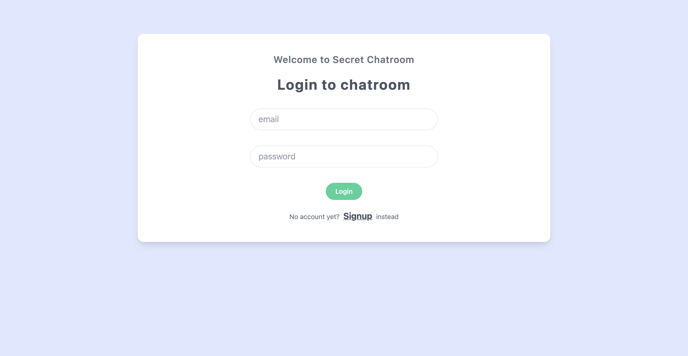
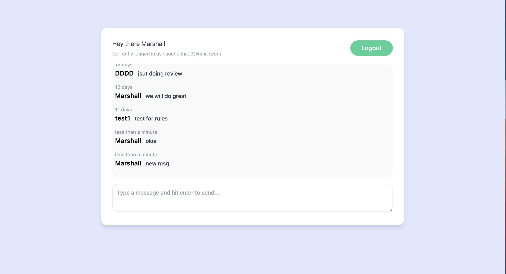

# Live-Chatroom-M

This is a live chatroom created by Marshall

This web-app can lets user chat with each other within the chatroom all aroun the world

## Technologies Used
- Generating using [Vue3] (https://v3.vuejs.org/)
- Using [Tailwindcss] for styling (https://tailwindcss.com/)
- [JavaScript] (https://developer.mozilla.org/en-US/docs/Web/JavaScript)
- [Firebase] for User Authentication/Database/Deployment (https://firebase.google.com/)

## Features
As a User:
- I can create a account, Login and chat with others (responsive view supported)

## Screenshot
Login:

Chatroom:


## Setup
Online Visit(https://nations-list.firebaseapp.com/)

For Localhost

```
npm install
```

### Compiles and hot-reloads for development
```
npm run serve
```

## Structure

Virtual Dom Structure

Main entrance: ```src/App.vue```
               ```src/main.js```

Views are in the ```src/views ```
  - Welcome:  ```Welcome.vue```
  - Chatroom: ```Chatroom.vue```

Components in the ```src/components```
  - ChatWindow: ```ChatWindow.vue```
  - LoginForm: ```LoginForm.vue```
  - Navbar: ```Navbar.vue```
  - NewChatForm:  ```NewChatForm.vue```
  - SignupForm:  ```SignupForm.vue```
  
  Reusable JS code in the ```src/composables```
  
  router is in the ```src/router```
